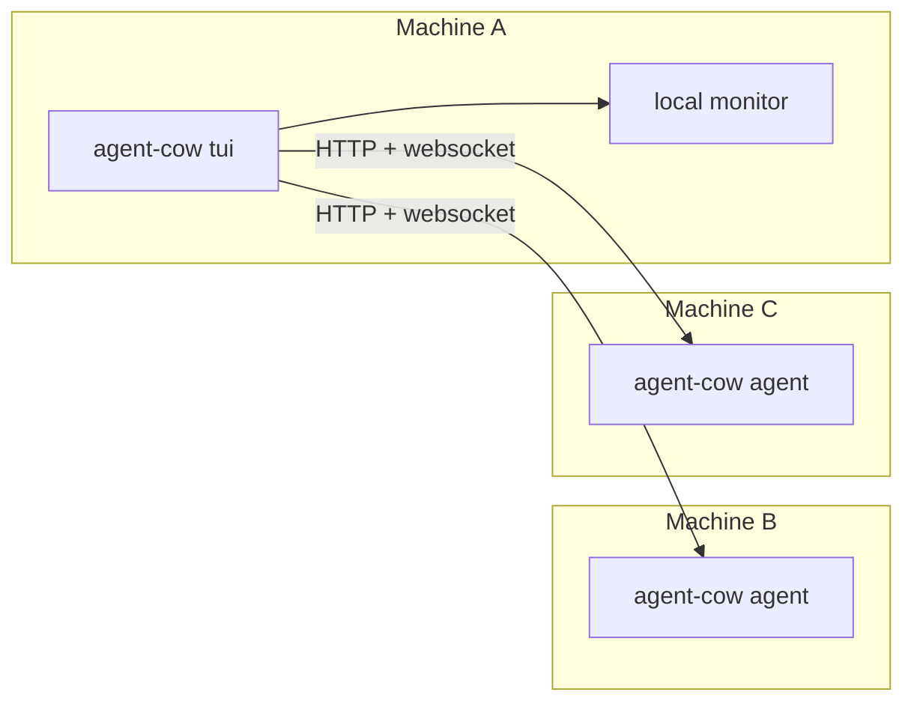

# Agent Cow

> **Agent Cow: the philosophical watcher of your agents.**

```text
 ______________________
< Agent 3 is stuck... >
 ----------------------
        \   ^__^
         \  (oo)\_______
            (__)\       )\/\
                ||----w |
                ||     ||
```

Agent Cow is a local-first observability tool for coding agents.

It watches your Codex and Claude sessions, shows what they are doing, what they cost, how much context they have burned, and whether they are waiting for you. It runs as a fast terminal UI, or as a headless machine agent that another TUI can subscribe to.

Today it supports **Codex** and **Claude**. The architecture is intentionally provider-oriented, so more agent runtimes can be added later without reinventing the UI or core data model.

No dashboard religion. No cloud dependency. Just a sharp TUI and a cow with opinions.

## Screenshot


## What It Does

- Watches **Codex** and **Claude** sessions from local machine state
- Shows **live session status**: `Thinking`, `Exploring`, `Compacting`, `Waiting`, `Idle`
- Tracks **tokens**, **cost**, **context usage**, and **quota/subscription** summaries
- Lets you open the underlying session in **Codex** or **Claude**
- Shows **Latest Conversation** so you can quickly see what an agent is doing
- Supports **multi-machine** setups with a headless `agent` mode
- Uses **HTTP + websocket subscriptions** for low-friction remote monitoring
- Is built to support **more providers in the future**

## Current Shape

- **TUI mode**: local all-in-one experience
- **Agent mode**: headless remote node for another TUI to connect to
- **Providers today**: Codex and Claude
- **Providers later**: whatever else is worth watching
- **Web UI**: intentionally not shipped right now

## Quick Start

### Run the TUI locally

```bash
cargo run -- tui
```

Or with a faster refresh:

```bash
cargo run -- tui --refresh-secs 1
```

### Inspect sessions from the CLI

```bash
cargo run -- sessions list --limit 20
```

```bash
cargo run -- sessions latest --json
```

```bash
cargo run -- sessions show <session-id> --json
```

## Multi-Machine Setup

Run a headless agent on each machine you want to observe:

```bash
cargo run -- agent --bind 0.0.0.0:8787
```

Then connect from your main TUI machine:

```bash
cargo run -- tui \
  --machine http://100.x.y.z:8787 \
  --machine http://100.x.y.w:8787
```

If you want remote-only:

```bash
cargo run -- tui --no-local --machine http://100.x.y.z:8787
```

Agent Cow works well over:

- Tailscale
- internal LAN IPs
- localhost for testing

## TUI Basics

Main keys:

- `j/k`: move
- `enter`: details
- `f`: latest conversation
- `o`: open session in the provider app
- `m`: cycle machine scope
- `/`: filter
- `r`: refresh
- `q`: quit

The top header shows:

- machine scope
- session count
- live scanning progress
- total spend
- total tokens
- provider quota/subscription summaries

## Why Agent Cow Exists

Because “I think the agent is doing something” is not observability.

You should be able to glance at a machine and know:

- which agent is alive
- which one is stuck
- which one is waiting for approval
- which one is compacting itself into oblivion
- which one is quietly burning money

That is the whole point.

## Architecture



High level:

- `agent-cow-core`: shared model + monitor service
- `agent-cow-codex`: Codex adapter
- `agent-cow-claude`: Claude adapter
- `apps/agent-cow`: CLI, TUI, headless agent

The TUI is a client. It is not the center of the system.

That split is deliberate: adding another provider should mostly mean adding another adapter crate, not rewriting the app.

## Environment

Optional overrides:

```bash
AGENT_COW_CODEX_HOME=...
AGENT_COW_CLAUDE_HOME=...
```

Agent Cow also falls back to normal local provider locations when possible.

## Performance Notes

Agent Cow is designed to stay cheap:

- staged startup loading
- persistent caches
- websocket subscriptions for remote updates
- local-first parsing instead of heavy centralized polling
- fast failure for slow remote machines

If performance is bad, that is a bug.

## Status

Open-source ready, actively evolving, and intentionally biased toward:

- fast terminal workflows
- local ownership of your data
- practical observability over pretty screenshots

## License

MIT
