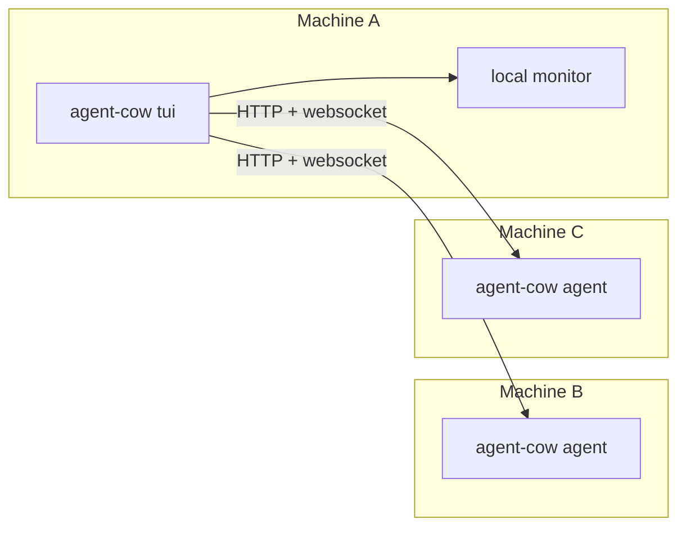

# Agent Cow

> **Agent Cow: the philosophical watcher of your agents.**

```text
 ______________________
< Agent 3 is stuck... >
 ----------------------
        \   ^__^
         \  (oo)\_______
            (__)\       )\/\
                ||----w |
                ||     ||
```

Agent Cow is an observability tool for your coding agents across your machines.

It watches your agent sessions, shows what they are doing, what they cost, how much context they have burned, and whether they are waiting for you. It runs as a fast terminal UI, or as a headless machine agent that another TUI can subscribe to.

Today it ships with **Codex** and **Claude** adapters. The architecture is intentionally provider-oriented, so more agent runtimes can be added later without reinventing the UI or core data model.

No dashboard religion. No cloud dependency. Just a sharp TUI and a cow with opinions.

The cow is a deliberate nod to the long and noble `cowsay` tradition. If you enjoy ranking terminal cattle, see [rank-amateur-cowsay](https://github.com/tnalpgge/rank-amateur-cowsay).

## See The Herd

The list view is the control tower: what is running, what is waiting, what is quietly burning tokens, and which machine it lives on.


## Crack Open A Session

The details pane shows the shape of a single run without forcing you to dig through raw logs: status, spend, context pressure, tokens, workspace, and execution state.


## Follow The Thread

Sometimes you do not need every event. You just need the latest conversation and the last few tool moves so you can tell whether the agent is making progress or waiting on you.


## What It Does

- Watches agent sessions from local machine state
- Shows **live session status**: `Thinking`, `Exploring`, `Compacting`, `Waiting`, `Idle`
- Tracks **tokens**, **cost**, **context usage**, and **quota/subscription** summaries
- Lets you open the underlying session in the provider app
- Shows **Latest Conversation** so you can quickly see what an agent is doing
- Supports **multi-machine** setups with a headless `agent` mode
- Uses **HTTP + websocket subscriptions** for low-friction remote monitoring
- Is built to support **more providers and runtimes in the future**

## Install

### Download a binary

If you just want to use Agent Cow, grab a prebuilt binary from [GitHub Releases](https://github.com/h0ngcha0/agent-cow/releases).

Release assets are published for:

- macOS Apple Silicon
- macOS Intel
- Linux x86_64
- Windows x86_64

Then unpack the archive for your platform and run:

```bash
agent-cow tui
```

Common first steps:

- local TUI: `agent-cow tui`
- headless node: `agent-cow agent --bind 0.0.0.0:8787`
- inspect via CLI: `agent-cow sessions list --limit 20`

### Build from source

If you want to build it yourself:

```bash
cargo build --release --manifest-path apps/agent-cow/Cargo.toml
```

The binary will be at:

```text
target/release/agent-cow
```

## Current Shape

- **TUI mode**: local all-in-one experience
- **Agent mode**: headless remote node for another TUI to connect to
- **Adapters today**: Codex and Claude
- **Adapters later**: whatever else is worth watching

## Quick Start

Using the built or downloaded binary:

```bash
agent-cow tui
```

If you are running directly from the repo without building first, use `cargo run -- ...` instead.

### Run the TUI locally

```bash
agent-cow tui
```

Or with a faster refresh:

```bash
agent-cow tui --refresh-secs 1
```

### Inspect sessions from the CLI

```bash
agent-cow sessions list --limit 20
```

```bash
agent-cow sessions latest --json
```

```bash
agent-cow sessions show <session-id> --json
```

## Multi-Machine Setup

Run a headless agent on each machine you want to observe:

```bash
agent-cow agent --bind 0.0.0.0:8787
```

Then connect from your main TUI machine:

```bash
agent-cow tui \
  --machine http://100.x.y.z:8787 \
  --machine http://100.x.y.w:8787
```

If you want remote-only:

```bash
agent-cow tui --no-local --machine http://100.x.y.z:8787
```

Agent Cow works well over:

- Tailscale
- internal LAN IPs
- localhost for testing

## Release Binaries

GitHub Actions publishes release archives automatically when you push a version tag:

```bash
git tag v0.1.0
git push origin v0.1.0
```

That workflow first runs formatting, clippy, and tests, then builds and uploads platform binaries to the matching GitHub Release.

If you are running straight from the repo instead of an installed binary, prepend `cargo run --` to the same commands.

## TUI Basics

Main keys:

- `j/k`: move
- `enter`: details
- `f`: latest conversation
- `o`: open session in the provider app
- `m`: cycle machine scope
- `/`: filter
- `r`: refresh
- `q`: quit

The top header shows:

- machine scope
- session count
- live scanning progress
- total spend
- total tokens
- provider quota/subscription summaries

## Why Agent Cow Exists

Because “I think the agent is doing something” is not observability.

You should be able to glance at a machine and know:

- which agent is alive
- which one is stuck
- which one is waiting for approval
- which one is compacting itself into oblivion
- which one is quietly burning money

That is the whole point.

## Architecture



High level:

- `agent-cow-core`: shared model + monitor service
- `agent-cow-codex`: Codex adapter
- `agent-cow-claude`: Claude adapter
- `apps/agent-cow`: CLI, TUI, headless agent

The TUI is a client. It is not the center of the system.

That split is deliberate: adding another provider should mostly mean adding another adapter crate, not rewriting the app.

## Environment

Optional overrides:

```bash
AGENT_COW_CODEX_HOME=...
AGENT_COW_CLAUDE_HOME=...
```

Agent Cow also falls back to normal local runtime locations when possible.

## Performance Notes

Agent Cow is designed to stay cheap:

- staged startup loading
- persistent caches
- websocket subscriptions for remote updates
- local-first parsing instead of heavy centralized polling
- fast failure for slow remote machines

If performance is bad, that is a bug.

## Status

Open-source, actively evolving, and intentionally biased toward:

- fast terminal workflows
- local ownership of your data
- practical observability over pretty screenshots

## License

MIT
